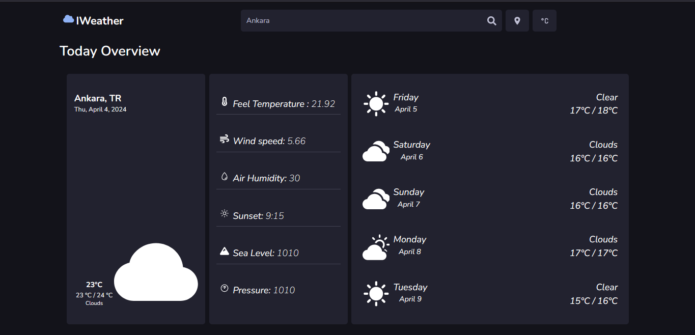

# ⛅IWeather 



IWeather is a weather web application developed using React, Tailwind CSS, Redux, and the OpenWeather API.

## Purpose

IWeather allows users to view weather information worldwide. Users can view the current weather conditions and forecasts for their desired locations.

## Features

* Users can view the current weather conditions for their selected locations.
* Users can view 5-day weather forecasts for their selected locations.
* Weather information and forecasts are retrieved from the OpenWeather API.

## How it Works

1. **Home Page**: Users can input a city name on the home page to view the weather information.

2. **City Selection**: Users can input a city name in the search bar to retrieve weather information and forecasts.

3. **Current Weather**: Users can view the current weather conditions for their selected locations. This includes temperature, humidity, wind speed, and weather description.

4. **5-Day Forecasts**: Users can view 5-day weather forecasts for their selected locations. Each day displays minimum and maximum temperatures, humidity, and weather description.

## Technologies Used

* React: A JavaScript library for building user interfaces.
* Tailwind: A CSS framework for quickly and easily styling user interfaces.
* Redux: A JavaScript library for state management.
* OpenWeather API: An API for retrieving weather data.

## Getting Started

To get started with IWeather, simply visit our website at [ıweather-app.vercel.app](https.example)

## Installation

1. Clone this project:
```bash
git clone https://github.com/ErsaGunTosun/IWeather.git
```

2. Navigate to the project directory:
```bash
cd IWeather
```

3. Install the required packages:
```bash
npm install
```

4. **Create a .env File:**
    - Create a new file named `.env` in the root directory of the project.
    - Open the .env file and add your `REACT_APP_API_KEY="api key"` , credentials, or any sensitive information needed for the project. Ensure this file is never shared or exposed publicly.

5. Start the application:
```bash
npm run start
``` 
The application runs by default on http://localhost:3000.


## Contact
If you have any questions or suggestions, feel free to reach out to us at [ersagun@ersaguntosun.com ](mailto:ersagun@ersaguntosun.com).

